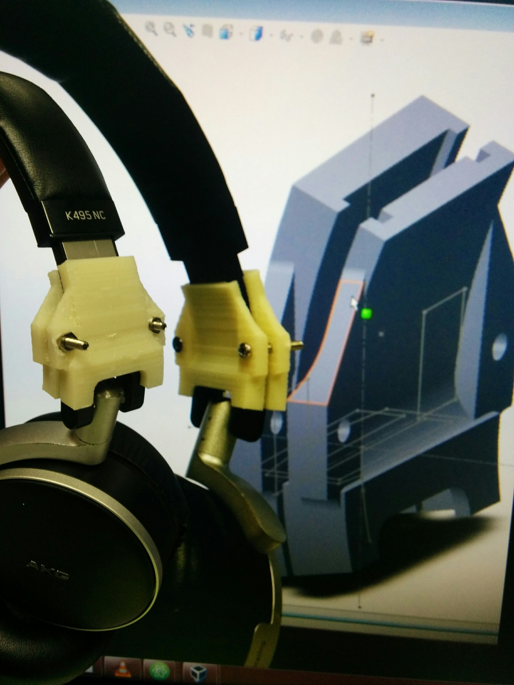
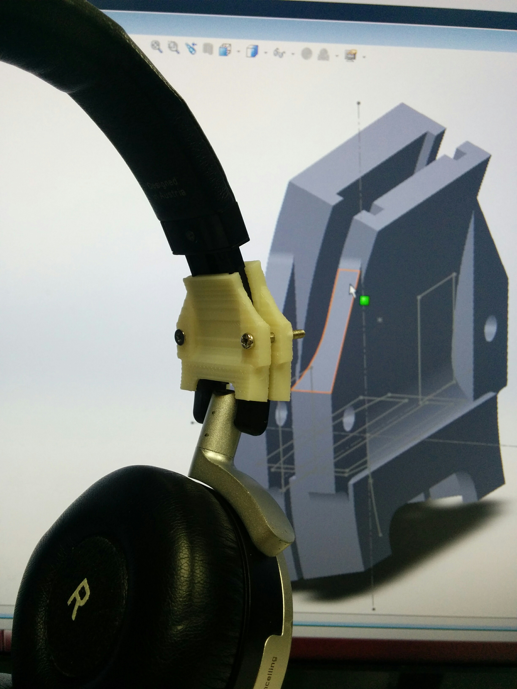
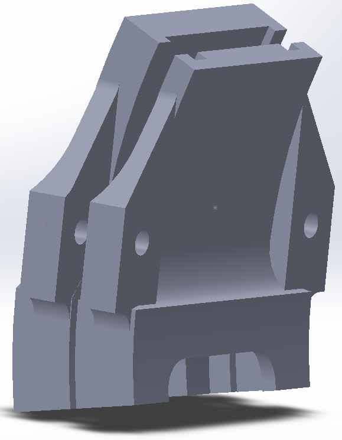

# akg-k495-n-nc-repair-parts

3D printable parts to repair AKG K495 N and AKG K495 NC headphones. You can use them to reinforce  the headband. See pictures below.

Files available in STL and Solidworks 2015 format.

## Example pictures

### Additional required parts

For each ear:

- Two screws M2x13 or longer
- Two M2 nuts
